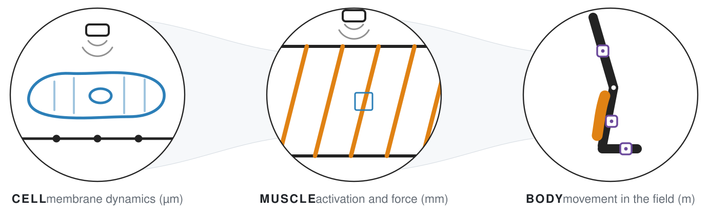

<picture>
  <source media="(prefers-color-scheme: dark)" srcset="assets/research-map-dark.svg">
  
</picture>

### Christoph Leitner

I study how the human body turns activation into motion, and build the open instruments to measure it, from printed piezoelectric sensors on the skin to body-worn sensing in the field. I lead the SNSF Ambizione project [MiNI](https://data.snf.ch/grants/grant/233457) at ETH Zurich, Integrated Systems Laboratory.

#### Ecosystems

| | |
|---|---|
| [**ModularUS**](https://github.com/ModularUS) | Modular ultrasound systems and algorithms: the ModulUS design platform, tools, and releases ([IEEE IUS 2025](https://doi.org/10.1109/IUS62464.2025.11201551), [Nature Sensors 2026](https://doi.org/10.1038/s44460-026-00118-z)) |

#### Recent

- 2026-08 · Lab-to-Fab perspective on translating wearable ultrasound, *Nature Sensors* ([doi](https://doi.org/10.1038/s44460-026-00118-z))
- 2026-08 · Multi-sensor edge-angle detection for ski jumping with Swiss-Ski, *IEEE Sensors Journal* ([doi](https://doi.org/10.1109/JSEN.2026.3725626))
- 2026-08 · ModularUS opens: our platform work in one place, first releases archived with DOIs

#### Community

[SIG-WUS](https://sig-wus.github.io/), the Special Interest Group in wearable ultrasound.

[ETH Zurich profile](https://iis.ee.ethz.ch/people/person-detail.christoph-leitner.html) · christoph.leitner@iis.ee.ethz.ch
